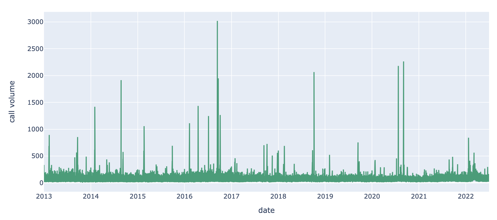

# 119 신고 접수량 예측

"AI Connect 모의경진대회" 

부산지역의 과거 119 신고접수 데이터와 전일 오후 6시에서 오전 9시 데이터를 이용하여 오전 9시에서 오후 6시 시간별 신고접수량 예측하는 대회.

**주최**: 중소벤처기업진흥공단

**주관**: 마인즈앤컴퍼니 (AI Connect)

<br>

## OverView

### 대회소개:
119종합상황실 2교대근무 주간(9시 to 18시) 야간(18시 to 9시) 주어진 과거 및 전일 야간근무 시간내의 119신고접수 데이터를 이용하여 오전 9시에서 오후 6시(주간근무시간) 신고접수량을 예측, 다시말해 시간별 신고 접수량을 예측하는 Regression 문제입니다.

**제한사항**: 외부데이터 사용불가

**참여기간**: 2023.09.04 ~ 09.08

**참여방식**: 개인

<br>

## 데이터
**input**: 전일오후6시-오전9시 119신고접수량 <br>
**output**: 오전9시-오후6시 119신고접수'예측'량

**train.csv** (6,415,802 rows X 6 columns) <br>
**test.csv** (144,604 rows X 6 columns)

<br>

**부산지역 119신고 접수 데이터**
- train: 2013년 1월 1일 ~ 2022년 6월 30일 
- test: 2022년 7월 1일 ~ 2022년 10월 15일
- 신고접수번호: 신고접수 건별 고유ID
- 접수경로: 신고 접수가 이루어진 경로
- 신고접수일시: 신고 접수 시간 (%Y%m%d_%H%M)
- 시군구: 접수 또는 출동 시/군/구
- 접수분류: 119 접수처리 결과 구분
- 긴급구조종류: 긴급구조출동 종류

<br>

**sample_submission.csv** (964 rows X 3 columns)
- train과 test 데이터는 6개 컬럼의 신고 접수 건별 데이터로 제공.
- 제출 데이터는 일별, 시간별 (00분~59분) 신고 접수량을 예측해야 함.
- sample_submission.csv와 동일한 형태로 예측 결과 제출.

<br>

## 평가지표

- 시간별 신고 접수량 예측값에 대해 평가

$$ MAPE = \frac{1}{n} \sum^n_{t=1} \left|\frac{yt-\hat{y}t}{yt}\right| $$

- 정답과 예측값의 오차 비율의 평균 ( Best Score = 0.0 )

<br>

## 데이터 전처리
<p align='center'> </p>


- 기존데이터가 'data type'이 아닌 '문자열 string'으로 되어있어 데이터전처리가 불가피했습니다.
- **input**: 전일 오후6시 ~ 해당일 오전9시 119신고접수량 
- 인풋데이터를 보면 6시간 전을 포함하여 기준일로 전날의 마지막 6시간을 맞물려 데이터를 가지고 있습니다. 추후 접수량계산시 해당일에 맞추는 번거로운 작업을 피하기 위해 접수일시를 6시간 밀려서 접수건과 접수일이 일치하도록 전처리를 진행했습니다.

<p align='center'> </p>

전처리 접수시간대인'hour'를 기준으로 집계량 y을 생성하여 시계열분석을 위한 준비를 완료했습니다.

<br>

## EDA 및 LSTM 예측 시도

<p align='center'></p>
<p align='center'> 시간대별 접수량의 분포표 </p>

<br>

<p align='center'></p>
<p align='center'> 13년도부터 22년도까지의 119신고접수량 시계열그래프 </p>

<br>

우선 **시계열 데이터**에 대한 간단한 **LSTM 모델**을 적용한 예측을 시도해보았습니다.

```
class LSTM(nn.Module):
    def __init__(self, input_dim, output_dim, hidden_size):
        super().__init__()
        self.lstm = nn.LSTM(input_size=input_dim, 
                            hidden_size=hidden_size, 
                            batch_first=True)
        self.fc1 = nn.Linear(hidden_size, hidden_size)
        self.fc2 = nn.Linear(hidden_size, hidden_size)
        self.fc3 = nn.Linear(hidden_size, output_dim)
        self.relu = nn.ReLU()
        self.bn = nn.BatchNorm1d(hidden_size, hidden_size)

    def forward(self, x):
        x, _ = self.lstm(x)
        x = self.fc1(x)
        x = self.relu(x)
        x = self.bn(x)
        x = self.fc2(x)
        x = self.relu(x)
        x = self.bn(x)
        x = self.fc3(x)
        return x
```

Train 데이터에 대하여 7:3 비율로 vaild 를 설정하고 훈련.
<p align='center'></p>

어느정도 학습이 되어 가는 것으로 확인하였으나,

<p align='center'></p>

학습된 결과를 시각화 해본결과 일관된 주기성은 예측 가능해보이나, 이상치에 대한 예측이 안되는 것으로 확인했습니다. 해당 날이 공휴일인지 아닌지에 따른 값들이 예측하는데 도움이 될 수도 있다는 판단도 있었으나, 이상치에 대한 진폭 큰 데이터가 해마다 일정한 공휴일에 해당되지 않다는 판단도 있었습니다. 

대신에 **시계열데이터를 정형데이터로 변경**, 부스트계열 모델로 예측하는 방법이 효과적인 사례가 있다는 것을 알게되었고 과감하게 **정형데이터로 변환하여 xgboost모델을 사용**해보기로 했습니다.

<br>

## 피쳐엔지니어링

### 시계열, 정형데이터 변환

xgboost 모델에 넣기위해서 시간대별 피쳐들을 생성하고 그 날이 주중인지 주말인지에 대한 피쳐도 추가했습니다.

<p align='center'></p>

데이터 훈련에 앞서 train, valid 데이터를 나누기전,
시계열 있는 정형데이터를 반영하기 위해서 valid 데이터를 test 데이터의 2022년 7월 1일 부터 10월 15일 시간대에 맞는 2021년 7월 1일 부터 10월 15일를 특정하여 설정해 주었습니다.

<p align='center'></p>

<br>

## 모델링 및 훈련

xgboost 모델에 적절한 파라미터를 찾아내기위해 K-fold 교차검증도 같이 수행할 수 있는 그리드서치를 진행했습니다.

### Grid Search Cross Validation

``` python
# 그리드 서치
from sklearn.model_selection import GridSearchCV

# Define the parameter grid for grid search
param_grid = {
    'n_estimators': [200],
    'max_depth': [2, 3, 4],
    'learning_rate': [0.1, 0.01, 0.001],
    'subsample': [0.8, 1],
    'colsample_bytree': [0.6, 0.8, 1],
}

# Create an XGBoost regressor object
model = XGBRegressor(random_state=42)

# Create a GridSearchCV object with cross-validation
grid_search = GridSearchCV(estimator=model,
                           param_grid=param_grid,
                           scoring='neg_mean_absolute_percentage_error',
                           cv=5,
                           )

# Fit the grid search to the training data
grid_search.fit(X_train, y_train)

# Print the best parameters and best score from grid search
print("Best Parameters:", grid_search.best_params_)
print("Best GS Score:", -grid_search.best_score_)
```

도출된 파라미터로 훈련을 진행했으며

``` python
# Hyperparameters
xgb_params = {
    'learning_rate': 0.1,
    'n_estimators': 200,
    'max_depth': 3,
    'random_state': 42,
    'subsample': 1,
    'colsample_bytree': 1
}

model = XGBRegressor(**xgb_params)

# training

eval_set = [(X_train, y_train), (X_val, y_val)]

model.fit(X=X_train,
          y=y_train,
          eval_set=eval_set,
          eval_metric="mape",
          early_stopping_rounds=20,
          verbose=1)
```

별도로 "early stopping"을 지정하여 과적합을 방지하고자 했습니다.

<p align='center'></p>

<br>

## 결과

- 60명 인원 중 5위를 달성했으며 

- Best 점수는 MAPE: 15.5567, 달성한 점수는 : MAPE:15.8617 로 마감했다.

<p align='center'></p>

<br>

## 한계점 및 회고

그리드서치통해 얻은 기본 하이퍼파라미터에 Early Stopping을 적용하여 학습했을때 제출한 서브미션에 가장 좋은 final 점수를 얻을수 있었으며, 여러차례 public에서 순위에 오르기 위한 하이퍼파라미더 조정들은 public 예측에서 과적합을 불러올뿐 final 점수를 낮아지기만 했다

- Best Scoring: Public MAPE: 15.7228, Final MAPE: 15.6377

- Submmision: Public MAPE: 15.6143, Final MAPE: 15.8617

최종 제출은 public에서 가장 높은 점수를 얻은 submission 을 제출했지만 final에서 오히려 더 많이 낮은 MAPE 가 나왔습니다.

우승자는 optuna를 사용하여 피쳐엔지니어링을 진행했으며 EDA와 피쳐엔지니어링에 좀더 다양한 시도가 이루워 지지 않은 한계가 아쉬움이 남습니다.

